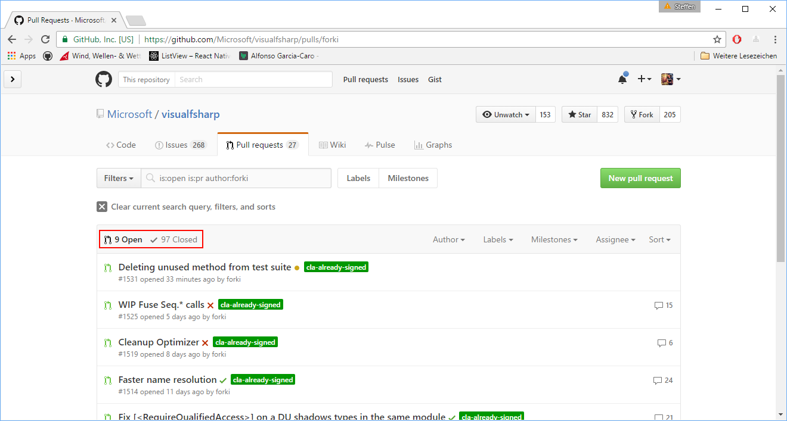
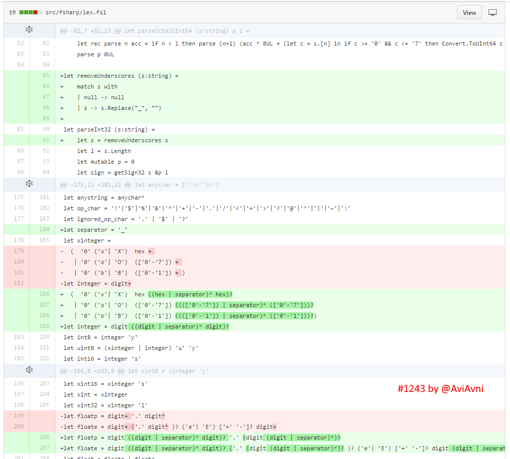
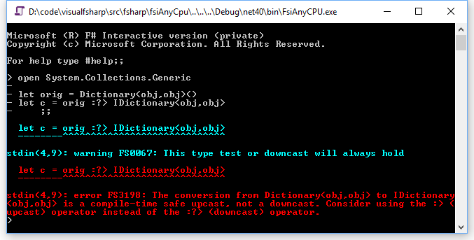
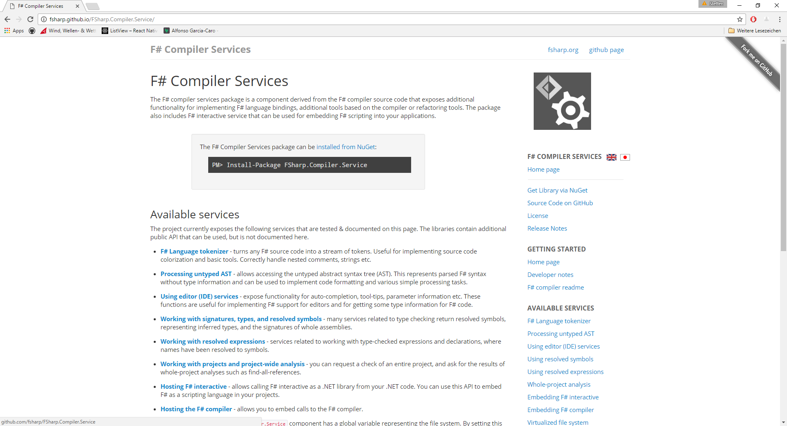

- title : F# compiler
- description : Excursion into the F# compiler
- author : Steffen Forkmann
- theme : night
- transition : default

***

### Excursion into the F# compiler

Steffen Forkmann

---

### Disclaimer

My current level: Knowing just enough to be dangerous

***

### What is a compiler?

---

Source code 
 
   -> Compiler
   
-> Program / Error message

***

### Lexer

  
Source code -> Lexer  ==> Stream of Tokens

---

---

### Tabs vs. Spaces

---

### Tabs vs. Spaces - lex.fsl

    let offwhite = ['\t']

    match token with
    ...
    | offwhite+  
        { if args.lightSyntaxStatus.Status then 
              errorR(Error(FSComp.SR.lexTabsNotAllowed(),lexbuf.LexemeRange))
          if not skip then 
              (WHITESPACE (LexCont.Token !args.ifdefStack)) 
          else 
              token args skip lexbuf }

---

## Pull Request #1243

    let creditCardNumber = 1234_5678_9012_3456L
    let socialSecurityNumber = 999_99_9999L
    let pi = 3.14_15F
    let hexBytes = 0xFF_EC_DE_5E
    let hexWords = 0xCAFE_BABE
    let maxLong = 0x7fff_ffff_ffff_ffffL
    let nybbles = 0b0010_0101
    let bytes = 0b11010010_01101001_10010100_10010010

---

---

### Pull Request #1243

    // before
    let integer = digit+

    // after
    let integer = digit ((digit | separator)* digit)?

***

### Parser

  
Source code -> Lexer -> Parser ==> Parse tree

---

### Euclidean algorithm

    while b != 0
        if a > b
            a := a − b
        else
            b := b − a
    return a

---

### Pull Request #1243

    let inline ( *. )  (x:int64)  (y:int64)  = (# "mul" x y : int64 #)

    // convert to int
    let ParseInt32 (s:string) = 
        if System.Object.ReferenceEquals(s,null) then
            raise( new System.ArgumentNullException("s") )
        let s = removeUnderscores (s.Trim())
        let l = s.Length 
        let mutable p = 0 
        let sign = getSign32 s & p l
        let specifier = get0OXB s & p l 
        if p >= l then formatError() else        
        match Char.ToLowerInvariant(specifier) with
        | 'x' -> 
            sign *. Int64.Parse(
                        s.Substring(p), 
                        NumberStyles.AllowHexSpecifier,
                        CultureInfo.InvariantCulture)
        | 'b' -> sign *. (int64OfUInt64 (parseBinaryUInt64 s p l))
        | 'o' -> sign *. (int64OfUInt64 (parseOctalUInt64 s p l))
        | _ -> Int64.Parse(s, NumberStyles.AllowLeadingSign, CultureInfo.InvariantCulture)

***

### Name resolution

  
Source code -> Lexer -> Parser -> Name resolution ==> AST

---

    open System
    open System.Collections.Generic

    let list = List<_>()
    list.Add 3

    type List = { ... }

    let f list = list.Length

    printfn "%A" list.Items

---

### Immutable maps FTW

    [<NoEquality; NoComparison>]
    /// The environment of information used to resolve names
    type NameResolutionEnv =
      { /// Values and Data Tags available by unqualified name 
        eUnqualifiedItems: LayeredMap<string,Item>
        /// Data Tags and Active Pattern Tags available by unqualified name 
        ePatItems: NameMap<Item>
        /// Modules accessible via "." notation. Note this is a multi-map. 
        eModulesAndNamespaces:  NameMultiMap<Tast.ModuleOrNamespaceRef>        
        /// Fully qualified modules and namespaces. 'open' does not change this. 
        eFullyQualifiedModulesAndNamespaces:  NameMultiMap<Tast.ModuleOrNamespaceRef>        
        /// RecdField labels in scope. 
        eFieldLabels: NameMultiMap<Tast.RecdFieldRef>

        /// ...

        /// Extension members by type and name 
        eIndexedExtensionMembers: TyconRefMultiMap<ExtensionMember>
        } 

---

---

### Pull Request #1102

---

### Pull Request #1102

---

    /// Resolve a long identifier representing a record field 
    let ResolveFieldPrim (ncenv:NameResolver) nenv ad typ (mp,id:Ident) fields =
        let typeNameResInfo = TypeNameResolutionInfo.Default
        let m = id.idRange
        match mp with 
        | [] -> 
            let lookup() = ...

            if isAppTy ncenv.g typ then 
                match ncenv.InfoReader.TryFindRecdOrClassFieldInfoOfType(id.idText,m,typ) with
                | Some (RecdFieldInfo(_,rfref)) -> 
                    [ResolutionInfo.Empty, FieldResolution(rfref,false)]
                | None ->
                    let typeName = NicePrint.minimalStringOfType nenv.eDisplayEnv typ
                    if isRecdTy ncenv.g typ then               
                        error(SuggestOtherLabelsOfSameRecordType nenv typeName id fields,m)
                    else
                        lookup()
            else 
                lookup()
        | _ -> ...

---

    /// Suggest other labels of the same record
    let SuggestOtherLabelsOfSameRecordType (nenv:NameResolutionEnv) typeName id fields =    
        let labelsOfPossibleRecord =
            nenv.eFieldLabels
            |> Seq.filter (fun kv -> 
                kv.Value 
                |> List.map (fun r -> r.TyconRef.DisplayName)
                |> List.exists ((=) typeName))
            |> Seq.map (fun kv -> kv.Key)
            |> Set.ofSeq

        let givenFields = 
            fields 
            |> List.map (fun fld -> fld.idText) 
            |> List.filter ((<>) id.idText)
            |> Set.ofList

        let predictedLabels = Set.difference labelsOfPossibleRecord givenFields
        let predictions = ErrorResolutionHints.FilterPredictions id.idText predictedLabels

        let errorCode,text = FSComp.SR.nrRecordDoesNotContainSuchLabel(typeName, id.idText)
        errorCode,text + ErrorResolutionHints.FormatPredictions predictions

---

    /// Filters predictions based on edit distance to an unknown identifier.
    let FilterPredictions unknownIdent allPredictions =
        allPredictions
        |> Seq.toList
        |> List.distinct
        |> List.sortBy (fun s -> EditDistance.CalcEditDistance(unknownIdent,s))
        |> take 5

***

### Type checking
#### Hindley-Milner Type Inference Algorithm

  
Source code -> Lexer -> Parser -> Name resolution  
-> Type checker ==> TAST

---

    type TcEnv =
      { eNameResEnv : NameResolutionEnv 
        eUngeneralizableItems: UngeneralizableItem list
        eCompPath: CompilationPath 
        eAccessPath: CompilationPath         
        eContextInfo : ContextInfo 
        eCallerMemberName : string option
        // ...
        }

    type cenv = 
      { g: TcGlobals
        tcSink: TcResultsSink 
        topCcu: CcuThunk  
        css: ConstraintSolverState
        // ...        
        } 
---

    let rec fib n = 
        if n <= 2 then 
            1
        else 
            fib (n - 1) + fib (n - 2)

---

    let UnifyTypes cenv (env: TcEnv) m expectedTy actualTy = 
        ConstraintSolver.AddCxTypeEqualsType env.eContextInfo env.DisplayEnv cenv.css m 
           (tryNormalizeMeasureInType cenv.g expectedTy) 
           (tryNormalizeMeasureInType cenv.g actualTy)

---

### Pull Request #1149

---

    let SolveTypSubsumesTypWithReport (csenv:ConstraintSolverEnv) ndeep m trace ty1 ty2 =
        TryD (fun () -> SolveTypSubsumesTypKeepAbbrevs csenv ndeep m trace ty1 ty2)
            (fun res ->
                match csenv.eContextInfo with
                | ContextInfo.RuntimeTypeTest ->
                    // test if we can cast other way around
                    match CollectThenUndo (fun _ -> SolveTypSubsumesTypKeepAbbrevs ...) with 
                    | OkResult _ -> ErrorD(...,ContextInfo.DowncastUsedInsteadOfUpcast)
                    | _ -> ErrorD(...,ContextInfo.NoContext)
                | _ -> ErrorD (...,csenv.eContextInfo)

***

### Optimizer

  
Source code -> Lexer -> Parser -> Name resolution  
-> Type checker -> Optimizer ==> TAST

---

    let rec OptimizeExpr cenv (env:IncrementalOptimizationEnv) expr =
        match expr with
        | Expr.Sequential _ | Expr.Let _ -> OptimizeLinearExpr cenv env expr id
        | Expr.Const (c,m,ty) -> OptimizeConst cenv env expr (c,m,ty)
        | Expr.Val (v,_vFlags,m) -> OptimizeVal cenv env expr (v,m)
        | Expr.Quote(ast,splices,isFromQueryExpression,m,ty) -> ...
        | Expr.App(f,fty,tyargs,argsl,m) -> 
            // eliminate uses of query
            match TryDetectQueryQuoteAndRun cenv expr with 
            | Some newExpr -> OptimizeExpr cenv env newExpr
            | None -> OptimizeApplication cenv env (f,fty,tyargs,argsl,m)
        ...

--- 

### Optimizer

* Inlining
* Inner lambda to top level funcs
* Removing tuples
* Optimize seq { } workflows
* Numeric calculations
* Beta reduction
* ...

---

### Optimizer

    let y = (fun x -> 2 + x * x) 3

    // beta reduction
    let y = 2 + 3 * 3

    // numeric calculations
    // (special form of beta reduction)
    let y = 11

---

### Optimizer outlook: Fusion

    ["hello"; "world"; "!"]
    |> Seq.map (fun (y:string) -> y.Length) 
    |> Seq.map (fun x -> x * 3)

    // after PR 1525 reduction
    ["hello"; "world"; "!"]
    |> Seq.map (fun x -> x.Length * 3)

---

    match expr' with
    // Rewrite Seq.map f (Seq.map g) xs into Seq.map (fun x -> f(g x)) xs
    | Expr.App(Expr.Val(outerValRef,_,_) as outerSeqMap,ttype1,[_;fOutType],
                [(Expr.Lambda(_,None,None,_,_,m1,fRetType) as f)
                    Expr.App(Expr.Val(innerValRef,_,_),_,[gInType;_],
                            [Expr.Lambda(_,None,None,gVals,g,_,gRetType)
                                rest],_)],m2) when
        valRefEq cenv.g innerValRef cenv.g.seq_map_vref &&
        valRefEq cenv.g outerValRef cenv.g.seq_map_vref 
            -> 
        let newApp = Expr.App(f,TType_fun(gRetType, fRetType),[],[g],m2)
        
        let reduced =
            Expr.App(outerSeqMap,ttype1,[gInType;fOutType],
                    [Expr.Lambda(newUnique(),None,None,gVals,newApp,m1,gRetType) 
                        rest],
                    m2)

        OptimizeExpr cenv env reduced
    | _ ->

***

### Code gen: IL Emitter

  
Source code -> Lexer -> Parser -> Name resolution  
-> Type checker -> Optimizer -> IL Emitter ==> Program / PDBs

---

    let rec GenExpr (cenv:cenv) (cgbuf:CodeGenBuffer) eenv sp expr sequel =
        match expr with 
        | Expr.Const(c,m,ty) -> 
            GenConstant cenv cgbuf eenv (c,m,ty) sequel
        | Expr.Match (spBind,exprm,tree,targets,m,ty) -> 
            GenMatch cenv cgbuf eenv (spBind,exprm,tree,targets,m,ty) sequel
        | Expr.Sequential(e1,e2,dir,spSeq,m) ->  
            GenSequential cenv cgbuf eenv sp (e1,e2,dir,spSeq,m) sequel
        | Expr.LetRec (binds,body,m,_)  -> 
            GenLetRec cenv cgbuf eenv (binds,body,m) sequel
        | Expr.Let (bind,body,_,_)  -> 
            // This case implemented here to get a guaranteed tailcall 
            // Make sure we generate the sequence point outside the scope of the variable
            let startScope,endScope as scopeMarks = StartDelayedLocalScope "let" cgbuf
            let eenv = AllocStorageForBind cenv cgbuf scopeMarks eenv bind
            let spBind = GenSequencePointForBind cenv cgbuf bind
            CG.SetMarkToHere cgbuf startScope 
            GenBindAfterSequencePoint cenv cgbuf eenv spBind bind
        | ...

---

### Code gen: Fable

---

### Code gen: FSharp.Compiler.Service

***

Thank you